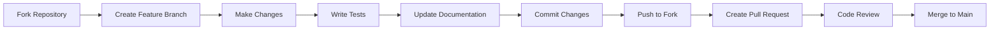

# Contributing to DiscoForge

<div align="center">
  
  
  ### 🤝 Help us build the future of Discord bot development!
  
  *We welcome contributions from developers of all skill levels*
  
</div>

---

## 📋 Table of Contents

- [Code of Conduct](#code-of-conduct)
- [Getting Started](#getting-started)
- [Development Setup](#development-setup)
- [How to Contribute](#how-to-contribute)
- [Contribution Guidelines](#contribution-guidelines)
- [Code Style Guide](#code-style-guide)
- [Commit Message Format](#commit-message-format)
- [Pull Request Process](#pull-request-process)
- [Testing](#testing)
- [Documentation](#documentation)
- [Community](#community)
- [Recognition](#recognition)

---

## 📜 Code of Conduct

By participating in this project, you agree to abide by our [Code of Conduct](CODE_OF_CONDUCT.md). We are committed to providing a welcoming and inclusive environment for all contributors.

### Our Pledge

- **Be Respectful**: Treat everyone with respect and professionalism
- **Be Inclusive**: Welcome newcomers and help them get started
- **Be Constructive**: Provide helpful feedback and suggestions
- **Be Patient**: Remember that everyone is learning and growing

---

## 🚀 Getting Started

### Prerequisites

Before contributing to DiscoForge, make sure you have:

- **Node.js** v16.9.0 or higher
- **npm** v7.0.0 or higher
- **Git** installed and configured
- A **Discord Developer Account** for testing
- Basic knowledge of **JavaScript** and **Discord.js**

### First Steps

1. **⭐ Star the repository** (it helps us grow!)
2. **🍴 Fork the repository** to your GitHub account
3. **📥 Clone your fork** to your local machine
4. **🔧 Set up the development environment**
5. **🎯 Choose an issue** to work on or propose a new feature

---

## 💻 Development Setup

### 1. Clone and Install

```bash
# Clone your fork
git clone https://github.com/YOUR_USERNAME/discoforge.git
cd discoforge

# Add the original repository as upstream
git remote add upstream https://github.com/original-owner/discoforge.git

# Install dependencies
npm install

# Install development dependencies
npm install --save-dev
```

### 2. Environment Configuration

```bash
# Copy the example environment file
cp .env.example .env

# Edit .env with your Discord bot credentials
nano .env
```

```env
# .env file
DISCORD_TOKEN=your_development_bot_token
DISCORD_CLIENT_ID=your_bot_client_id
MONGO_URL=mongodb://localhost:27017/discoforge_dev
DEBUG=discoforge:*
NODE_ENV=development
```

### 3. Database Setup (Optional)

```bash
# For MongoDB (if contributing to database features)
# Install MongoDB locally or use MongoDB Atlas
# The connection string goes in your .env file
```

### 4. Verify Setup

```bash
# Run the bot in development mode
npm run dev

# Run tests to ensure everything works
npm test

# Check code formatting
npm run lint
```

---

## 🛠️ How to Contribute

### Types of Contributions We Welcome

<table>
<tr>
<td width="50%">

#### 🐛 **Bug Reports**
- Found a bug? Report it!
- Provide detailed reproduction steps
- Include error logs and screenshots
- Use the bug report template

#### 💡 **Feature Requests**
- Suggest new features
- Explain the use case
- Provide mockups if applicable
- Discuss implementation ideas

</td>
<td width="50%">

#### 🔧 **Code Contributions**
- Fix bugs and issues
- Implement new features
- Improve performance
- Add tests and documentation

#### 📚 **Documentation**
- Improve existing docs
- Write tutorials and guides
- Fix typos and errors
- Translate documentation

</td>
</tr>
</table>

### Good First Issues

New to the project? Look for issues labeled:
- `good first issue` - Perfect for beginners
- `help wanted` - Community help needed
- `documentation` - Documentation improvements
- `bug` - Bug fixes (easier ones)

---

## 📋 Contribution Guidelines

### Before You Start

1. **Check existing issues** - Avoid duplicate work
2. **Discuss major changes** - Open an issue first for big features
3. **Follow the roadmap** - Align with project direction
4. **Read the documentation** - Understand the project structure

### Development Workflow



### Branch Naming Convention

Use descriptive branch names:

```bash
# Feature branches
git checkout -b feature/add-music-commands
git checkout -b feature/improve-error-handling

# Bug fix branches
git checkout -b fix/command-cooldown-bug
git checkout -b fix/memory-leak-issue

# Documentation branches
git checkout -b docs/update-installation-guide
git checkout -b docs/add-api-examples

# Hotfix branches (for urgent production fixes)
git checkout -b hotfix/security-vulnerability
```

---

## 🎨 Code Style Guide

### JavaScript Style

We follow **ESLint** configuration with these key principles:

```javascript
// ✅ Good Examples

// 1. Use const/let instead of var
const client = new Client({ intents: [GatewayIntentBits.Guilds] });
let userCount = 0;

// 2. Use arrow functions for short functions
const formatUser = user => `${user.username}#${user.discriminator}`;

// 3. Use async/await instead of promises
async function handleCommand(interaction) {
  try {
    await interaction.deferReply();
    const result = await fetchUserData(interaction.user.id);
    await interaction.editReply({ content: result });
  } catch (error) {
    console.error('Command failed:', error);
    await interaction.editReply({ content: 'Something went wrong!' });
  }
}

// 4. Use destructuring when appropriate
const { name, description, cooldown } = command;
const [firstArg, ...restArgs] = args;

// 5. Use template literals for strings
const message = `Welcome ${user.username} to ${guild.name}!`;

// 6. Consistent indentation (2 spaces)
if (condition) {
  doSomething();
  if (anotherCondition) {
    doSomethingElse();
  }
}
```

### File Structure Standards

```javascript
// Command file template
const { ApplicationCommandType } = require("discord.js");

/**
 * @type {import("../../Base/baseCommand")}
 */
module.exports = {
  // Command metadata
  name: "command-name",
  description: "Command description",
  category: "category-name",
  
  // Permissions and restrictions
  cooldown: 5,
  botPermissions: ["SendMessages"],
  userPermissions: ["SendMessages"],
  
  // Command configuration
  command: {
    enabled: true,
    aliases: ["alias1", "alias2"],
    minArgsCount: 0,
    usage: "[optional] <required>"
  },
  
  slashCommand: {
    enabled: true,
    global: true
  },
  
  // Execution functions
  async msgExecute(client, message, args) {
    // Prefix command logic
  },
  
  async interactionExecute(client, interaction) {
    // Slash command logic
  }
};
```

### Naming Conventions

```javascript
// Variables and functions: camelCase
const userName = "John";
const getUserData = async (id) => { /* ... */ };

// Constants: UPPER_SNAKE_CASE
const MAX_RETRIES = 3;
const DEFAULT_PREFIX = "!";

// Classes: PascalCase
class CommandHandler {
  constructor() { /* ... */ }
}

// Files: kebab-case or camelCase
// user-info.js or userInfo.js
// command-loader.js or CommandLoader.js
```

---

## 📝 Commit Message Format

We use **Conventional Commits** for clear and consistent commit history:

### Format

```
<type>(<scope>): <description>

[optional body]

[optional footer]
```

### Types

| Type | Description | Example |
|------|-------------|---------|
| `feat` | New feature | `feat(commands): add music player command` |
| `fix` | Bug fix | `fix(handlers): resolve memory leak in event loader` |
| `docs` | Documentation | `docs(readme): update installation instructions` |
| `style` | Code style changes | `style(commands): fix indentation in ping command` |
| `refactor` | Code refactoring | `refactor(utils): simplify permission checking logic` |
| `test` | Adding tests | `test(commands): add unit tests for user commands` |
| `chore` | Maintenance | `chore(deps): update discord.js to latest version` |
| `perf` | Performance improvements | `perf(database): optimize user query performance` |

### Examples

```bash
# Good commit messages
git commit -m "feat(commands): add advanced moderation tools"
git commit -m "fix(events): prevent duplicate message handling"
git commit -m "docs(contributing): add code style guidelines"
git commit -m "refactor(handlers): improve error handling consistency"

# Bad commit messages (avoid these)
git commit -m "fixed stuff"
git commit -m "update"
git commit -m "changes"
git commit -m "asdf"
```

### Multi-line Commit Example

```bash
git commit -m "feat(commands): add music player functionality

- Add play, pause, stop, skip commands
- Implement queue management system
- Add volume controls and equalizer
- Support for YouTube, Spotify, and SoundCloud
- Add playlist import/export features

Closes #123
Co-authored-by: John Doe <john@example.com>"
```

---

## 🔄 Pull Request Process

### 1. Preparation Checklist

Before creating a pull request:

- [ ] **Code follows style guidelines**
- [ ] **All tests pass** (`npm test`)
- [ ] **Linting passes** (`npm run lint`)
- [ ] **Documentation is updated**
- [ ] **Commit messages follow convention**
- [ ] **Branch is up to date with main**

### 2. Creating the Pull Request

```bash
# Ensure your branch is up to date
git fetch upstream
git checkout main
git merge upstream/main
git checkout your-feature-branch
git rebase main

# Push your changes
git push origin your-feature-branch
```

### 3. Pull Request Template

When creating a PR, use this template:

```markdown
## 📋 Description
Brief description of what this PR does.

## 🔗 Related Issue
Closes #123 (if applicable)

## 🧪 Type of Change
- [ ] Bug fix (non-breaking change which fixes an issue)
- [ ] New feature (non-breaking change which adds functionality)
- [ ] Breaking change (fix or feature that would cause existing functionality to not work as expected)
- [ ] Documentation update

## ✅ Testing
- [ ] I have tested this change locally
- [ ] I have added tests for this change
- [ ] All existing tests pass

## 📝 Checklist
- [ ] My code follows the project's style guidelines
- [ ] I have performed a self-review of my code
- [ ] I have commented my code, particularly in hard-to-understand areas
- [ ] I have made corresponding changes to the documentation
- [ ] My changes generate no new warnings

## 📸 Screenshots (if applicable)
Add screenshots to help explain your changes.

## 💭 Additional Notes
Any additional information, concerns, or questions.
```

### 4. Review Process

1. **Automated Checks**: CI/CD pipeline runs tests and linting
2. **Code Review**: Maintainers review your code
3. **Feedback**: Address any requested changes
4. **Approval**: Get approval from at least one maintainer
5. **Merge**: Your PR gets merged into main branch

### 5. After Merge

```bash
# Clean up your local environment
git checkout main
git pull upstream main
git branch -d your-feature-branch
git push origin --delete your-feature-branch
```

---

## 🧪 Testing

### Running Tests

```bash
# Run all tests
npm test

# Run tests in watch mode
npm run test:watch

# Run tests with coverage
npm run test:coverage

# Run specific test file
npm test -- --grep "CommandLoader"

# Run linting
npm run lint

# Fix linting issues automatically
npm run lint:fix
```

### Writing Tests

We use **Jest** for testing. Here's how to write good tests:

```javascript
// tests/commands/ping.test.js
const { Client } = require('discord.js');
const PingCommand = require('../../src/Commands/misc/Ping');

describe('Ping Command', () => {
  let client;
  let mockInteraction;

  beforeEach(() => {
    client = new Client({ intents: [] });
    client.ws = { ping: 50 };
    
    mockInteraction = {
      reply: jest.fn(),
      user: { id: '123' }
    };
  });

  test('should respond with pong and latency', async () => {
    await PingCommand.interactionExecute(client, mockInteraction);
    
    expect(mockInteraction.reply).toHaveBeenCalledWith({
      content: ':ping_pong: Pong 50 ms',
      ephemeral: true
    });
  });

  test('should handle message command correctly', async () => {
    const mockMessage = {
      reply: jest.fn(),
      author: { id: '123' }
    };
    
    await PingCommand.msgExecute(client, mockMessage, []);
    
    expect(mockMessage.reply).toHaveBeenCalledWith(':ping_pong: Pong 50 ms');
  });
});
```

### Test Coverage Requirements

- **New features**: Must include tests
- **Bug fixes**: Should include regression tests
- **Minimum coverage**: 80% for new code
- **Integration tests**: For complex features

---

## 📚 Documentation

### Types of Documentation

1. **Code Comments**: Explain complex logic
2. **JSDoc**: Document functions and classes
3. **README Updates**: Keep installation and usage guides current
4. **API Documentation**: Document public APIs
5. **Tutorials**: Step-by-step guides for users

### Documentation Standards

```javascript
/**
 * Loads and registers all commands from the Commands directory
 * @param {Client} client - The Discord client instance
 * @param {string} [directory] - Custom directory path (optional)
 * @returns {Promise<Map>} A map of loaded commands
 * @throws {Error} Throws error if command loading fails
 * 
 * @example
 * const commands = await loadCommands(client);
 * console.log(`Loaded ${commands.size} commands`);
 */
async function loadCommands(client, directory = './src/Commands') {
  // Implementation...
}
```

### Writing Good Documentation

- **Be Clear**: Use simple, direct language
- **Be Comprehensive**: Cover all important aspects
- **Use Examples**: Show practical usage
- **Keep Updated**: Maintain accuracy with code changes
- **Be Consistent**: Follow established patterns

---

## 👥 Community

### Communication Channels

<table>
<tr>
<td align="center" width="33%">

### 💬 Discord Server
Real-time chat and support

[](https://discord.gg/AT6W2nHEVz)

</td>
<td align="center" width="33%">

### 💭 GitHub Discussions
Feature discussions and Q&A

[](https://github.com/your-username/discoforge/discussions)

</td>
<td align="center" width="33%">

### 🐛 GitHub Issues
Bug reports and feature requests

[](https://github.com/your-username/discoforge/issues)

</td>
</tr>
</table>

### Community Guidelines

- **Be Respectful**: Treat everyone with kindness
- **Stay On Topic**: Keep discussions relevant
- **Help Others**: Share your knowledge
- **Be Patient**: Everyone is learning
- **Follow Discord/GitHub ToS**: Respect platform rules

### Getting Help

1. **Check Documentation**: Look for existing answers
2. **Search Issues**: See if your question was asked before
3. **Join Discord**: Ask for real-time help
4. **Create Discussion**: For feature ideas and questions
5. **Open Issue**: For bugs and specific problems

---

## 🏆 Recognition

We believe in recognizing our contributors! Here's how we show appreciation:

### Contributor Levels

| Level | Requirements | Benefits |
|-------|-------------|----------|
| **🌟 First Time** | First merged PR | Welcome package, Discord role |
| **🚀 Regular** | 5+ merged PRs | Contributor badge, early access |
| **💎 Core** | 20+ PRs, active community | Maintainer consideration |
| **👑 Maintainer** | Trusted core contributor | Full project access |

### Ways We Recognize Contributors

- **README.md Credits**: Listed in contributors section
- **Discord Roles**: Special roles in our Discord server
- **Contributor Badges**: GitHub profile badges
- **Feature Credits**: Credit in release notes for major features
- **Annual Awards**: Special recognition for outstanding contributors

### Hall of Fame

Our top contributors are featured in:
- Project README
- Website contributors page
- Discord announcements
- Social media shoutouts

---

## 🚨 Issue Templates

### Bug Report Template

```markdown
---
name: Bug Report
about: Create a report to help us improve
title: '[BUG] Brief description'
labels: 'bug'
assignees: ''
---

## 🐛 Bug Description
A clear and concise description of what the bug is.

## 🔄 Steps to Reproduce
1. Go to '...'
2. Click on '....'
3. Scroll down to '....'
4. See error

## ✅ Expected Behavior
A clear description of what you expected to happen.

## ❌ Actual Behavior
A clear description of what actually happened.

## 📸 Screenshots
If applicable, add screenshots to help explain your problem.

## 💻 Environment
- OS: [e.g. Windows 10, macOS 11.2, Ubuntu 20.04]
- Node.js Version: [e.g. 16.14.0]
- DiscoForge Version: [e.g. 1.2.3]
- Discord.js Version: [e.g. 14.7.1]

## 📋 Additional Context
Add any other context about the problem here.

## 🔍 Possible Solution
If you have ideas on how to fix this, please share them.
```

### Feature Request Template

```markdown
---
name: Feature Request
about: Suggest an idea for this project
title: '[FEATURE] Brief description'
labels: 'enhancement'
assignees: ''
---

## 💡 Feature Description
A clear and concise description of the feature you'd like to see.

## ❗ Problem Statement
What problem does this feature solve? Why is it needed?

## 💭 Proposed Solution
Describe the solution you'd like to see implemented.

## 🎯 Use Cases
Describe specific scenarios where this feature would be useful.

## 🎨 Mockups/Examples
If applicable, add mockups, diagrams, or code examples.

## 📋 Additional Context
Add any other context, screenshots, or examples about the feature request.

## 🚧 Implementation Ideas
If you have ideas about how this could be implemented, share them here.
```

---

## 🎯 Development Roadmap Participation

Want to help shape DiscoForge's future? Here's how:

### Current Focus Areas

1. **Performance Optimization** - Help make DiscoForge faster
2. **Documentation Improvement** - Better guides and examples  
3. **Testing Coverage** - More comprehensive testing
4. **Feature Expansion** - New commands and handlers
5. **Developer Experience** - Better tooling and debugging

### How to Get Involved

- **Join Planning Discussions** in our Discord
- **Vote on Feature Priorities** in GitHub Discussions
- **Propose New Features** through issues
- **Contribute to Roadmap** planning sessions

---

## ❓ Frequently Asked Questions

### General Questions

**Q: I'm new to Discord bot development. Can I still contribute?**
A: Absolutely! We welcome contributors of all skill levels. Start with issues labeled `good first issue`.

**Q: How long does it take for PRs to be reviewed?**
A: We aim to review PRs within 48-72 hours. Complex changes may take longer.

**Q: Can I work on multiple issues at once?**
A: For new contributors, we recommend working on one issue at a time to ensure quality.

### Technical Questions

**Q: Do I need to run a Discord bot to contribute?**
A: For most contributions, yes. You'll need a test bot to verify your changes work correctly.

**Q: What if my PR conflicts with recent changes?**
A: Rebase your branch on the latest main branch and resolve any conflicts.

**Q: Should I update the documentation for small changes?**
A: If your change affects user-facing behavior, please update relevant documentation.

---

## 🎉 Thank You!

Thank you for your interest in contributing to DiscoForge! Every contribution, no matter how small, helps make the framework better for everyone.

### Ready to Contribute?

1. **🍴 Fork the repository**
2. **📥 Clone to your machine** 
3. **🔧 Set up development environment**
4. **🎯 Find an issue to work on**
5. **💻 Start coding!**

### Need Help?

Don't hesitate to reach out:
- **Discord**: Join our community server
- **GitHub**: Open a discussion or issue
- **Email**: Contact the maintainers

---

<div align="center">
  
  ### 🌟 Happy Contributing! 🌟
  
  *Let's build something amazing together!*
  
  [](https://discord.gg/AT6W2nHEVz)
  
  **Made with ❤️ by the DiscoForge Community**
  
</div>